# 🧩 LevelNine-Services – System Architecture Blueprint

LevelNine-Services is a modular, AI-centric SaaS platform built around a **multi-repo microservice model** with a **centralized MCP (Model Context Protocol) AI Gateway**. It supports Demo, Development, Test/Staging, and Production environments with cloud-only automation.

---

## 📊 High-Level Architecture

```mermaid
flowchart TD
    subgraph CLIENT["Frontend (Vercel · Bun · Astro + Solid)"]
      UI[Astro UI / Chat / Dashboard]
      AUTH[Auth.js / Supabase Auth]
      UI -->|"HTTPS / JWT"| API
    end

    subgraph API_LAYER["API (Fly.io · Fastify + pnpm)"]
      API[Fastify REST + SSE]
      DB[(Postgres / pgvector)]
      CACHE[(Redis)]
      API -->|"DB Queries"| DB
      API -->|"Session / Cache"| CACHE
      API -->|"MCP Calls"| MCP
    end

    subgraph AI_CORE["Agent-Core (Fly.io · pnpm)"]
      MCP["🧠 MCP Server"]
      ROUTER["Provider Router"]
      TOOLS["MCP Tools (listProjects · triggerDeploy · queryDB · getWeather)"]
      PROVIDERS["LLM/TTS Providers (OpenAI · Ollama · ElevenLabs)"]
      MCP --> ROUTER --> PROVIDERS
      ROUTER --> DB
      MCP --> TOOLS
    end

    subgraph INFRA["Infra (OpenTofu · Terragrunt · GitHub Actions)"]
      TOFU[OpenTofu Modules]
      TERR[Terragrunt Envs]
      GH[GitHub CI/CD]
      TOFU --> TERR --> GH
    end

    UI --> API
    API --> MCP
    MCP --> DB
    INFRA -->|provisions| API
    INFRA -->|manages| MCP
    INFRA -->|deploys| CLIENT
```

---

## 🗂️ Repository Layout (Multi-Repo Strategy)

| Repo | Purpose | Key Tech | CI/CD Source |
| ---- | ------- | -------- | ------------- |
| `frontend` | End-user experience, dashboards, chat UI | Astro (Bun), Solid components, Tailwind | Vercel (preview/prod) + ChatOps deploys |
| `api` | REST/SSE gateway, business logic, auth integration | Fastify, TypeScript, pnpm, Redis client | Fly.io deploy; GitHub Actions for tests |
| `agent-core` | MCP server hosting toolsets and provider routing | TypeScript, OpenAI + local adapters, pnpm | Fly.io deploy; integrates with MCP registry |
| `infra` | OpenTofu modules + Terragrunt stacks for shared infra | HCL, Terragrunt, GitHub Actions | ChatOps `/bootstrap`, `/deploy` orchestration |
| `levelnine-blueprint` | This umbrella repo with docs, ChatOps, org automation | Markdown, bash | Acts as ChatOps control plane |

---

## 🌐 Environments & Promotion Flow

| Tier | Branch / Trigger | Deploy Target | Data Tier | Notes |
| ---- | ---------------- | ------------- | --------- | ----- |
| Demo | Manual `/deploy env=demo` | Vercel Preview + Fly demo apps | Supabase (shared) | Customer demos, ephemeral credentials |
| Dev  | PR merge to `main` or `/deploy env=dev` | Vercel Preview + Fly dev app | Neon serverless | Fast iteration, linked to feature PRs |
| Test/Staging | `/deploy env=test` or `/deploy env=staging` | Fly staging app | Render Postgres (managed) | Release candidate validation |
| Prod | `/deploy env=prod` with manual approval | Fly prod app + Vercel prod | Fly Postgres via OpenTofu | Requires change advisory + secrets sync |

Secrets (GitHub → Deploy target) are synchronized via `/secrets:sync`, which fans out to service repos using GitHub Actions tokens.

---

## 🤖 MCP Agent-Core Responsibilities

- **Context brokering**: Normalize prompts from UI/API and enrich with contextual data (project metadata, user preferences, environment status).
- **Provider routing**: Dynamic selection between OpenAI, Ollama (self-hosted), and ElevenLabs (TTS) based on task metadata.
- **Tool orchestration**: Implements MCP tool interfaces for deployment triggers, database queries, project search, and telemetry lookups.
- **Fallback logic**: Circuit breakers around provider latency, with Redis caching of recent conversations for resilience.

---

## 🔐 Identity & Access

- **Frontend** authenticates via Supabase Auth (Auth.js) and obtains JWTs.
- **API** validates JWT tokens, issues session cookies (if required), and resolves role-based access to domain operations.
- **Agent-Core** trusts API-issued service tokens; interactions from MCP tools to external services use scoped PATs or workload identities.
- **Secrets** live in GitHub Actions → repo/environment secrets; `/bootstrap` seeds org structure while remaining a dry run unless `CONFIRM=YES`.

---

## 🚀 Delivery & ChatOps Automation

- `/bootstrap CONFIRM=YES env=dev` ensures downstream repos exist, seeds basic README/CI scaffolding, and (optionally) secrets.
- `/deploy env=<tier>` drives environment rollouts (integration with Vercel CLI or Fly CLI to be wired in per tier).
- `/db:provision env=<tier>` creates or updates database resources across providers (Supabase/Neon/Render/Fly).
- `/secrets:sync` synchronizes tokens across service repos ensuring consistent environment configuration.
- All commands run via `.github/workflows/chatops.yml`, enforcing actor allow-lists and command guardrails.

---

## 📈 Observability & Operations

- **Logging**: Structured logs shipped to provider-native targets (Fly logs, Vercel telemetry) and centralized via OpenTofu-defined sinks.
- **Metrics**: Future integration with Prometheus-compatible collectors; metrics forwarded to Grafana Cloud (placeholder).
- **Tracing**: OpenTelemetry instrumentation in API + Agent-Core, exporting traces to Honeycomb or Tempo (to be configured).
- **Alerts**: GitHub Actions → Slack/Teams ChatOps hooks for deploy/db events; future Terraform modules will provision PagerDuty services.

---

## 🛡️ Security Posture

- Principle of least privilege enforced through GitHub fine-grained PATs and environment secrets.
- Use GitHub CODEOWNERS + branch protection per repo; ChatOps enforces actor allow-list.
- Infrastructure automation via OpenTofu + Terragrunt with plan/apply split, enabling manual approval for production stacks.
- Regular secrets rotation via `/secrets:sync` plus external vault integration (future work).

---

## 📅 Roadmap Snapshot

1. Wire real deploy commands in `deploy` job (Vercel + Fly CLI integration).
2. Implement database provisioning scripts mapped to each provider.
3. Add automated integration tests (API ↔ Agent-Core) in downstream repos.
4. Provision observability stack via `infra` repo (OpenTofu modules).
5. Integrate MCP toolset expansion (project analytics, incident triage).

---

_Last updated: 2025-10-16_
